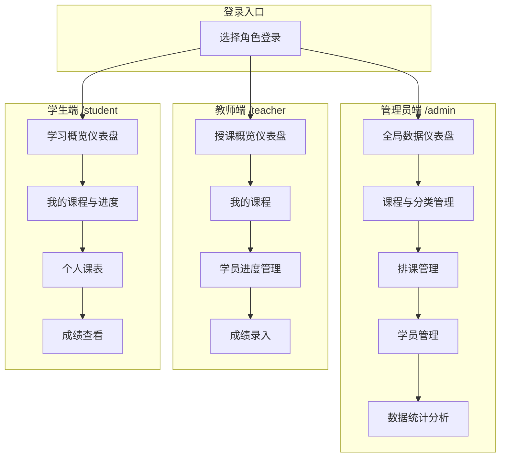

## 1. 产品概述

课程管理实施平台是一个面向教育机构的全流程课程管理系统，提供**三大独立门户**——管理员端、教师端、学生端，分别满足不同角色的使用需求。

- 解决传统课程管理中信息分散、角色权限不清、排课冲突、沟通效率低等问题
- 目标用户：教育机构的管理人员、教师、学生
- 提供课程管理、学员管理、排课管理、学习追踪、成绩统计等全链路功能

## 2. 核心功能

### 2.1 用户角色

| 角色 | 登录方式 | 专属门户 | 核心权限 |
|------|----------|----------|----------|
| 管理员 | 账号密码登录 | /admin | 课程管理、分类管理、学员管理、排课管理、数据统计 |
| 教师 | 账号密码登录 | /teacher | 查看课程、管理学员进度、录入成绩 |
| 学生 | 账号密码登录 | /student | 查看已报名课程、课程表、学习进度、成绩 |

### 2.2 三大门户功能模块

#### 管理员端 (/admin)
1. **仪表盘**：全局数据概览（课程总数、学员总数、进行中课程、近期报名）
2. **课程管理**：课程创建、编辑、上下架、分类管理
3. **学员管理**：学员信息管理、查看学员详情与学习进度
4. **排课管理**：日历视图排课、新建排课
5. **数据统计**：课程分类分布、状态分布、报名趋势、完成率分析

#### 教师端 (/teacher)
1. **仪表盘**：我的授课概览（授课课程数、学员总数、待批改任务）
2. **我的课程**：查看我教授的课程列表与详情
3. **学员进度**：查看所授课程的学员名单、学习进度、管理进度更新
4. **成绩录入**：为学员录入课程成绩

#### 学生端 (/student)
1. **仪表盘**：我的学习概览（已报名课程数、学习进度、待完成课程）
2. **个人画像**：展示个人信息、学习统计、能力雷达图、学习轨迹
3. **课程管理**：可按学年查询课程列表，每个课程卡片展示知识图谱（JSON格式）、课程基础信息、成绩信息，点击"进入学习"进入课程学习页面
4. **课程学习**（点击进入学习后）：AI分层展示（基础层/进阶层/卓越层），包含学前画像、学习任务、资源库、综合评价、AI批改作业
5. **成绩管理**：查看各课程成绩、学分统计、绩点计算
6. **我的课表**：日历视图查看个人课程安排
7. **额外功能**：扩展功能模块

### 2.3 页面详情

| 门户 | 页面名称 | 功能描述 |
|------|----------|----------|
| 通用 | 登录页 | 选择角色（管理员/教师/学生），输入账号密码登录 |
| 管理员 | 仪表盘 | 全局数据统计卡片 + 报名趋势折线图 + 近期活动 |
| 管理员 | 课程管理 | 课程卡片网格展示、搜索筛选、新建/编辑弹窗 |
| 管理员 | 分类管理 | 课程分类增删改、颜色选择器 |
| 管理员 | 学员管理 | 学员列表搜索筛选、学员详情页 |
| 管理员 | 排课管理 | 月/周/日日历视图、新建排课弹窗 |
| 管理员 | 数据统计 | 分类分布、状态分布、报名分布、完成率图表 |
| 教师 | 仪表盘 | 授课概况（授课数、学员数、待批改数） |
| 教师 | 我的课程 | 教师所授课程列表 |
| 教师 | 学员进度 | 课程学员列表、进度条展示、进度更新 |
| 教师 | 成绩录入 | 为学员录入成绩 |
| 学生 | 仪表盘 | 学习概况（报名数、进度、待完成） |
| 学生 | 个人画像 | 个人信息、学习统计、能力雷达图、学习轨迹 |
| 学生 | 课程管理 | 按学年查询课程、知识图谱JSON展示、课程基础信息、成绩信息、进入学习 |
| 学生 | 课程学习 | AI分层（基础/进阶/卓越）、学前画像、学习任务、资源库、综合评价、AI批改作业 |
| 学生 | 成绩管理 | 课程成绩列表、学分统计、绩点计算 |
| 学生 | 我的课表 | 个人课程日历视图 |
| 学生 | 额外功能 | 扩展功能模块 |

## 3. 核心流程

### 3.1 管理员操作流程
登录管理员端 → 仪表盘查看全局数据 → 课程管理创建课程 → 排课管理安排时间 → 学员管理查看报名 → 数据统计分析运营

### 3.2 教师操作流程
登录教师端 → 仪表盘查看授课概况 → 我的课程查看课程详情 → 学员进度查看学习情况 → 成绩录入为学员评分

### 3.3 学生操作流程
登录学生端 → 仪表盘查看学习概况 → 我的课程查看已报名课程 → 我的课表查看课程安排 → 学习进度查看成绩

### 3.4 核心流程图示

## 4. 用户界面设计

### 4.1 设计风格

- **主色调**：深蓝(#0f172a)为主色，搭配琥珀橙(#f59e0b)作为强调色
- **辅助色**：石板灰(#64748b)用于文本，翠绿(#10b981)用于成功状态，玫瑰红(#f43f5e)用于警告
- **门户色彩区分**：管理员端强调色为琥珀橙，教师端强调色为翠绿(#10b981)，学生端强调色为天蓝(#3b82f6)
- **按钮样式**：圆角8px，带细微阴影，hover时轻微上浮效果
- **字体**：标题使用「Noto Sans SC」粗体，正文使用「Noto Sans SC」常规体
- **布局风格**：左侧固定导航栏 + 右侧内容区域的经典后台布局，内容区域采用卡片式设计
- **卡片设计**：白色背景，圆角12px，带细微边框和阴影，hover时阴影加深
- **图标风格**：使用简洁的线性图标，统一16px/20px/24px三档尺寸

### 4.2 页面设计概述

| 页面 | 门户 | 核心UI元素 |
|------|------|-----------|
| 登录页 | 通用 | 角色选择卡片 + 表单输入，角色卡片选中态高亮 |
| 仪表盘 | 管理员 | 4个统计卡片 + 折线图 + 近期活动列表 |
| 课程管理 | 管理员 | 课程卡片网格 + 搜索筛选 + 模态弹窗表单 |
| 分类管理 | 管理员 | 分类卡片 + 颜色选择器 |
| 学员管理 | 管理员 | 学员列表卡片 + 搜索筛选 + 详情页 |
| 排课管理 | 管理员 | 日历组件 + 新建排课弹窗 |
| 数据统计 | 管理员 | 柱状图、饼图、折线图 |
| 仪表盘 | 教师 | 3个统计卡片 + 近期课程列表 |
| 我的课程 | 教师 | 课程卡片列表 |
| 学员进度 | 教师 | 学员列表 + 进度条 + 更新按钮 |
| 成绩录入 | 教师 | 学员列表 + 成绩输入框 |
| 仪表盘 | 学生 | 3个统计卡片 + 近期课程 |
| 我的课程 | 学生 | 课程卡片 + 进度条 |
| 我的课表 | 学生 | 日历视图 |
| 学习进度 | 学生 | 进度列表 + 成绩展示 |

### 4.3 响应式适配

- 采用桌面优先设计，最低支持1280px宽度
- 侧边导航栏可折叠，适应小屏笔记本
- 表格在窄屏时支持横向滚动
- 所有弹窗和模态框支持键盘操作(ESC关闭)

## 5. 技术栈选型

| 技术 | 用途 |
|------|------|
| React 18 + TypeScript | 前端框架 |
| Vite | 构建工具 |
| Tailwind CSS 3 | 样式框架 |
| React Router 6 | 路由管理 |
| Zustand | 状态管理 |
| Recharts | 图表库 |
| React Big Calendar | 日历组件 |
| Lucide React | 图标库 |