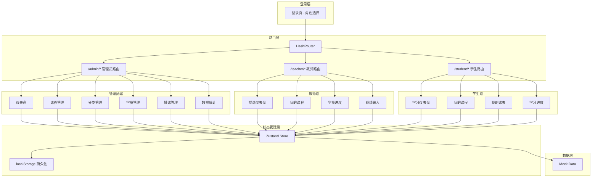
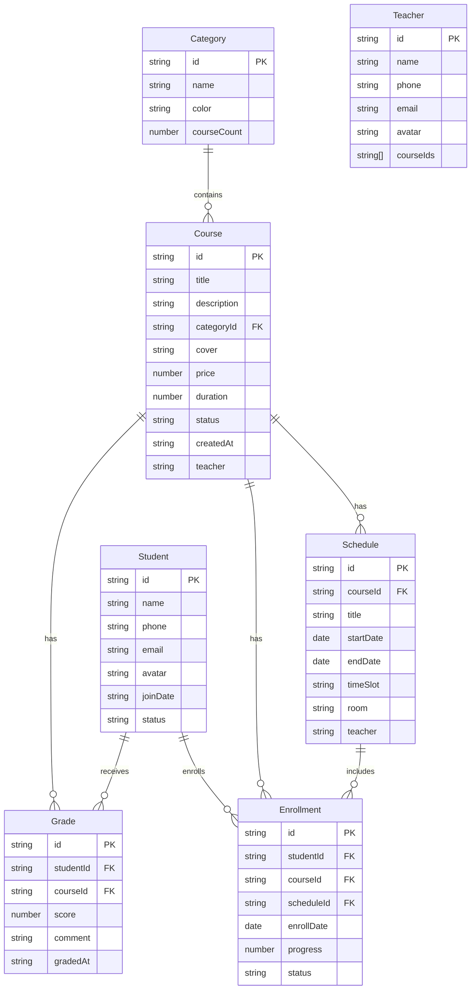

## 1. 架构设计



## 2. 技术描述

- **前端框架**：React 18 + TypeScript + Vite
- **初始化工具**：Vite (create-vite)
- **样式方案**：Tailwind CSS 3（自定义主题配置）
- **路由方案**：React Router 6（HashRouter），三级路由结构
- **状态管理**：Zustand（统一 Store，按角色区分数据）
- **图表库**：Recharts
- **日历组件**：React Big Calendar（date-fns 本地化）
- **图标库**：Lucide React
- **数据层**：Mock Data + localStorage 持久化
- **后端**：无（纯前端应用，本地数据存储）

## 3. 路由定义

### 3.1 通用路由

| 路由路径 | 页面名称 | 说明 |
|----------|----------|------|
| /login | 登录页 | 角色选择 + 账号密码登录 |
| / | 重定向 | 根据角色重定向到对应门户 |

### 3.2 管理员端 (/admin)

| 路由路径 | 页面名称 | 说明 |
|----------|----------|------|
| /admin | 重定向 | → /admin/dashboard |
| /admin/dashboard | 仪表盘 | 全局数据概览 |
| /admin/courses | 课程管理 | 课程列表管理 |
| /admin/categories | 分类管理 | 课程分类管理 |
| /admin/students | 学员管理 | 学员列表 |
| /admin/students/:id | 学员详情 | 查看学员详情与进度 |
| /admin/schedule | 排课管理 | 日历排课视图 |
| /admin/statistics | 数据统计 | 统计看板 |

### 3.3 教师端 (/teacher)

| 路由路径 | 页面名称 | 说明 |
|----------|----------|------|
| /teacher | 重定向 | → /teacher/dashboard |
| /teacher/dashboard | 仪表盘 | 授课概况 |
| /teacher/courses | 我的课程 | 所授课程列表 |
| /teacher/students | 学员进度 | 课程学员进度管理 |
| /teacher/grades | 成绩录入 | 为学员录入成绩 |

### 3.4 学生端 (/student)

| 路由路径 | 页面名称 | 说明 |
|----------|----------|------|
| /student | 重定向 | → /student/dashboard |
| /student/dashboard | 仪表盘 | 学习概况 |
| /student/profile | 个人画像 | 个人信息、学习统计、能力雷达图 |
| /student/courses | 课程管理 | 按学年查询课程、知识图谱、成绩信息 |
| /student/courses/:id | 课程学习 | AI分层学习页面（基础/进阶/卓越） |
| /student/grades | 成绩管理 | 课程成绩、学分、绩点 |
| /student/schedule | 我的课表 | 个人课程日历 |
| /student/extra | 额外功能 | 扩展功能模块 |

## 4. 数据模型

### 4.1 实体关系图



### 4.2 数据模型定义

```typescript
interface Category {
  id: string;
  name: string;
  color: string;
  courseCount: number;
}

interface Course {
  id: string;
  title: string;
  description: string;
  categoryId: string;
  cover: string;
  price: number;
  duration: number;
  status: 'active' | 'inactive' | 'draft';
  createdAt: string;
  teacher: string; // 授课教师名
}

interface Student {
  id: string;
  name: string;
  phone: string;
  email: string;
  avatar: string;
  joinDate: string;
  status: 'active' | 'inactive';
}

interface Teacher {
  id: string;
  name: string;
  phone: string;
  email: string;
  avatar: string;
  courseIds: string[];
}

interface Schedule {
  id: string;
  courseId: string;
  title: string;
  startDate: string;
  endDate: string;
  timeSlot: string;
  room: string;
  teacher: string;
}

interface Enrollment {
  id: string;
  studentId: string;
  courseId: string;
  scheduleId: string;
  enrollDate: string;
  progress: number;
  status: 'enrolled' | 'in_progress' | 'completed' | 'dropped';
}

interface Grade {
  id: string;
  studentId: string;
  courseId: string;
  score: number;
  comment: string;
  gradedAt: string;
}
```

## 5. 组件架构

### 5.1 通用组件

| 组件 | 用途 |
|------|------|
| Layout | 主布局，包含侧边导航和内容区域 |
| Sidebar | 侧边导航栏，根据角色显示不同菜单 |
| StatCard | 统计卡片组件 |
| Modal | 模态弹窗组件 |
| Empty | 空状态组件 |

### 5.2 门户页面组件

| 门户 | 页面 | 核心组件 |
|------|------|----------|
| 管理员 | Dashboard | StatCard, TrendChart, RecentActivity |
| 管理员 | Courses | CourseCard, CourseFilter, CourseFormModal |
| 管理员 | Categories | CategoryList, CategoryForm |
| 管理员 | Students | StudentCard, StudentFilter |
| 管理员 | StudentDetail | StudentInfo, ProgressCard |
| 管理员 | Schedule | CalendarView, ScheduleFormModal |
| 管理员 | Statistics | BarChart, PieChart, LineChart |
| 教师 | Dashboard | StatCard, CourseList |
| 教师 | Courses | CourseCard |
| 教师 | Students | StudentProgressList, ProgressUpdateForm |
| 教师 | Grades | GradeEntryTable |
| 学生 | Dashboard | StatCard, CourseList |
| 学生 | Courses | CourseCard, ProgressBar |
| 学生 | Schedule | CalendarView |
| 学生 | Progress | ProgressList, GradeDisplay |

## 6. 数据存储策略

- 应用启动时从 localStorage 读取数据
- 所有数据变更操作同时更新内存状态和 localStorage
- 提供初始化 Mock 数据，首次使用时自动填充
- Mock 数据包含 13 门课程、5 个分类、16 名学员、4 名教师、22 条排课记录、20 条报名记录